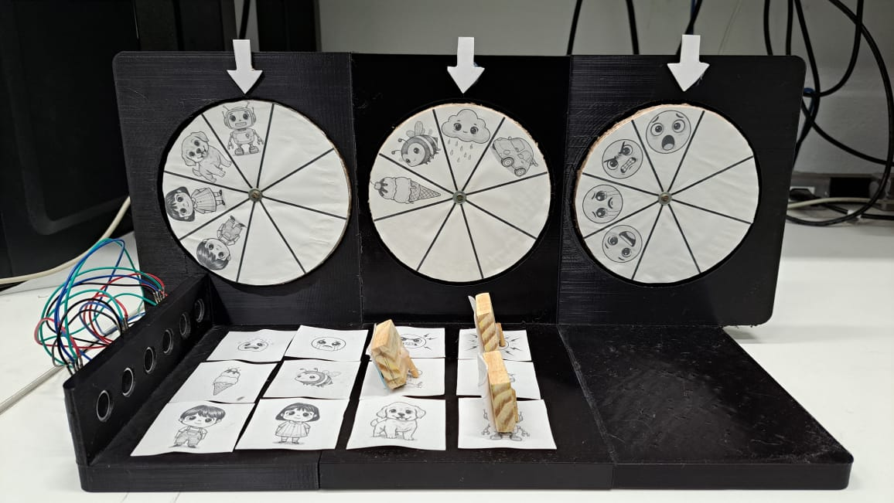
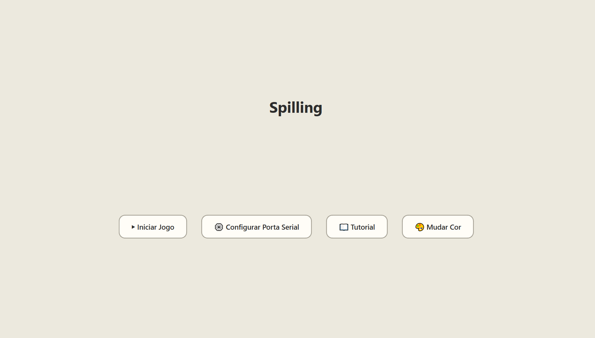

# Spilling 🌀💙

**Spilling** (uma junção de "Spinning" e "Feeling") é um jogo sério híbrido (físico e digital) desenvolvido para auxiliar no desenvolvimento socioemocional e cognitivo de crianças com Transtorno do Espectro Autista (TEA).

Este projeto foi desenvolvido como parte da disciplina **PCS3645 - Laboratório Digital II** da Escola Politécnica da USP.

## 🎯 Propósito do Projeto

A proposta central do Spilling é utilizar uma interface tangível para ensinar como personagens reagem a diferentes objetos e situações, transformando conceitos abstratos de empatia e causalidade em uma interação física concreta.

O jogo visa:
* **Estimular a Empatia:** A criança deve deduzir emoções baseadas em contexto.
* **Reforço Positivo:** O sistema prioriza o incentivo e evita punições, mantendo o engajamento.
* **Tangibilidade:** O uso de controles físicos promove a coordenação motora fina e oferece uma noção concreta de causa e efeito.

## 🎮 Como Funciona

O sistema opera através da integração entre uma aplicação de software e uma estrutura de hardware (controlada por uma FPGA).

1.  **Lógica:** O jogo apresenta "equações emocionais" (ex: *Menino + Sorvete = Feliz*), imagens com contextos e "equações emocionais" omitindo elementos.
2.  **Interface Física:** O jogador utiliza suportes físicos para selecionar o Personagem, a Situação e a Emoção. Sensores de distância leem a escolha e enviam para o software.
3.  **Feedback:** A tela exibe animações de sucesso ou encorajamento, e a estrutura física responde girando discos para confirmar a seleção.

### A Interface Digital

A aplicação foi desenvolvida em **Python** utilizando a biblioteca **PyQt6**. Ela possui um design limpo, com cores suaves para evitar sobrecarga sensorial.

Funcionalidades da interface:
* **Menu Principal:** Opções para Iniciar Jogo, Configurar Porta Serial (para conexão com a FPGA), Tutorial e Personalização de Cor de Fundo.
* **Fases Progressivas:** 12 níveis que evoluem de associação direta para inferência lógica.
* **Feedback Visual:** Telas de vitória e mensagens de apoio ("Quase lá") em caso de erro.

---

## 📸 Imagens

### Estrutura Física
*(A estrutura conta com discos giratórios e base para seleção de peças via sensores ultrassônicos)*


> *Vista da bancada com os discos e a área de seleção.*

### Interface do Usuário


> *Exemplo de fase: Associação de elementos.*

---

## 🚀 Como Rodar a Aplicação

Para executar a interface do jogo em seu computador, siga os passos abaixo. É recomendado o uso de um ambiente virtual (`venv`) para gerenciar as dependências.

### Pré-requisitos
* Python 3.x instalado.

### Passo a Passo

1.  **Crie e ative o ambiente virtual (venv):**

    * *No Windows:*
        ```bash
        python -m venv venv
        .\venv\Scripts\activate
        ```
    * *No Linux/macOS:*
        ```bash
        python3 -m venv venv
        source venv/bin/activate
        ```

2.  **Instale as dependências:**
    *(Certifique-se de ter as bibliotecas `PyQt6` e `pyserial` instaladas)*
    ```bash
    pip install PyQt6 pyserial
    ```

3.  **Execute o jogo:**
    O arquivo principal está localizado dentro da pasta `Aplicação`.
    ```bash
    python Aplicação/main.py
    ```

> **Nota:** Para o funcionamento completo do jogo, a placa FPGA deve estar conectada via USB e a porta serial correta deve ser selecionada no menu de configurações ("Configurar Porta Serial"). No entanto, é possível abrir a interface gráfica para visualização mesmo sem o hardware conectado.

---

## 👨‍💻 Autores

* **Andrey Rocha Reboredo**
* **Caíque Cavalcante e Pachá**
* **Lucas Sposo Cavalari**

---
*Departamento de Engenharia de Computação e Sistemas Digitais (PCS) - POLI USP*
